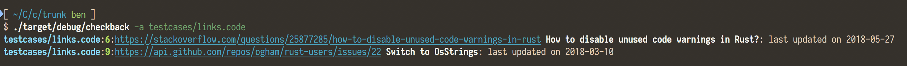

# checkback

Have you ever had to include a reference in your code so you can check back on
it later, but then you forget?

```rust
// can't do this until generic associated types lands:
// https://github.com/rust-lang/rust/issues/44265
```

**checkback** is a tool that scans your source code for links to GitHub issues
and StackOverflow questions, queries them using their APIs, and reports if any
have had any updates within the last month. With luck, someone will have
posted an answer, fix, or workaround for your problem, meaning you can update
your code and remove the link.


